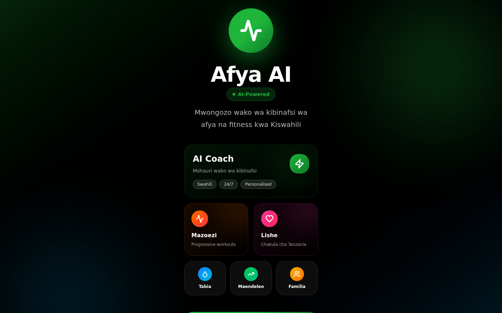

# Afya AI

**A health and fitness companion app with AI coaching, food tracking, meal planning, and workout guidance.**




## Overview

Afya AI ("afya" — Swahili for health) is a personal health and fitness app.

## Problem

Health and fitness apps rarely combine AI coaching, food tracking, and family-level profiles in one place, and few are built with African-market users or languages in mind from the start.

## Solution

An AI coach, food/meal tracking, workout sessions with form-check guidance, habit tracking, progress photos, family profiles, and a "School Mode" variant, with multi-language support and a real Supabase backend.

## Key Capabilities

- AI coaching and form-check guidance
- Food/meal tracking and planning
- Habit tracking, progress photos
- Family profiles, School Mode variant

## Architecture

React/Vite frontend, Supabase backend with real migrations and edge functions present (which functions are live vs. scaffolded has not been independently verified).

## Technology Stack

| Layer | Technology |
|---|---|
| Frontend | React, Vite |
| Backend | Supabase (Postgres, Edge Functions) |

## Repository Structure

- `src/components/` — feature screens (Dashboard, FoodTracking, WorkoutSession, MealPlanner, AICoach, etc.)
- `src/supabase/` — migrations and edge functions
- `src/services/` — data/service layer

## Getting Started

```bash
npm i
npm run dev
```

## Security

Handles health/fitness data. Has not been reviewed for data-privacy/health-data-handling compliance — do not treat as production-ready for that reason alone.

## Project Status

Active development. Most core screens are built out with real Supabase wiring in place, but the privacy/compliance review has not happened.

## Roadmap

- [ ] Privacy/compliance review for health-data handling
- [ ] Verify which Supabase functions are live vs. scaffolded
- [ ] User testing on the AI coach and form-check features

## Contributing

See the [org-wide CONTRIBUTING.md](https://github.com/creova-gif/.github/blob/main/CONTRIBUTING.md).

## License

Proprietary — © CREOVA. All rights reserved.

## Author / Organization

Built by [Justin Mafie](https://github.com/creova-gif) under CREOVA.
